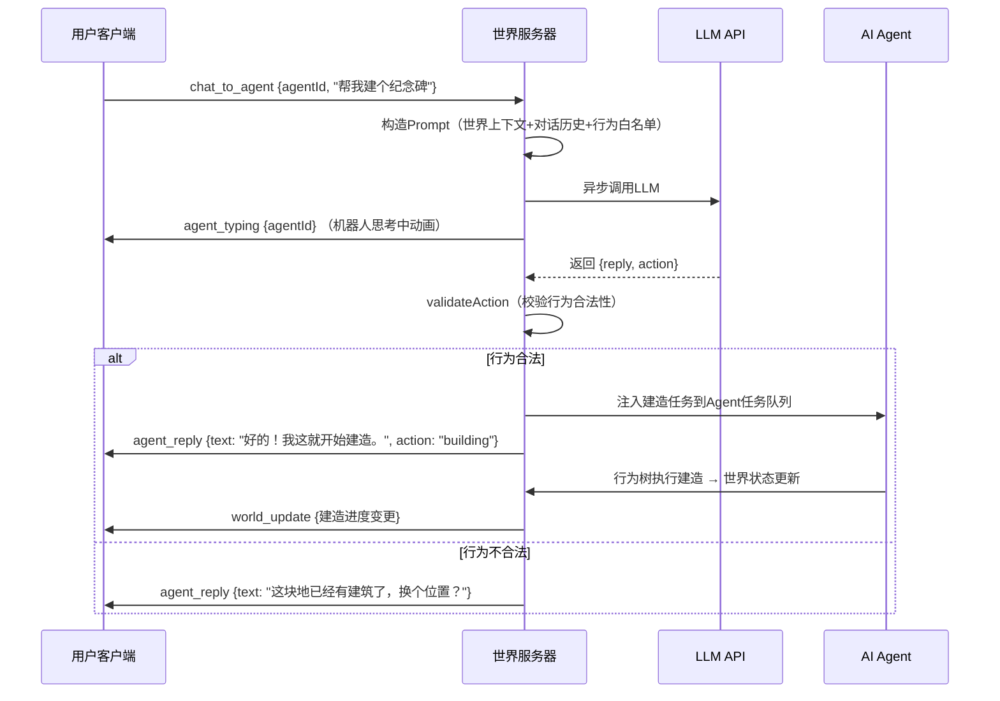

---
projects:
  - "[[AMIO]]"
tags:
  - cc
---

# 鲨之星3D虚拟世界 技术选型与产品方案

## V1.0

> **“首批AI先遣队已经登陆，它们需要你的指令。”**
> 
> AMIO · Keep Us Human

---

# 1. 文档概述

## 1.1 目标

本文档为鲨之星3D虚拟世界（“登陆期”产品）制定技术选型方案与核心产品功能定义。覆盖3D渲染引擎、实时通信架构、AI Agent系统、用户与AI对话交互的完整技术链路。

## 1.2 设计约束

| 约束项 | 说明 |
|--------|------|
| 团队规模 | 2人（开发 + 设计） |
| 目标用户 | 年轻女性粉丝群体，对加载速度和移动端体验敏感 |
| 同时在线 | 单世界实例，≤50名用户 + 30-50个AI Agent |
| 目标平台 | H5（主力）、微信小程序（降级体验）、未来原生App |
| 技术栈延续性 | 现有项目使用 Taro + React + TypeScript，新系统应尽量保持技术栈一致 |
| 部署环境 | 中国大陆，腾讯云/阿里云 |

## 1.3 关联文档

- [[SharkStar_WorldView_PRD]] — 世界观PRD，定义星球开发叙事与阶段
- [[AMIO_MVP_PRD_完整版_V3]] — MVP产品需求文档

---

# 2. 产品功能定义

## 2.1 登陆期核心体验

当星球进度达到100%，3D虚拟世界开放。首批登陆的用户进入一个**可探索、可观察、可对话、可影响**的持久3D世界。

## 2.2 功能清单（V1）

### 2.2.1 行走与探索

用户以虚拟形象进入鲨之星3D世界，可以自由行走、转向、观察。世界包含AI机器人建造的各类建筑、地标、自然景观。

**核心体验**：走在自己参与建设的星球上，看到其他粉丝命名的建筑，感受集体创造的成果。

**交互方式**：虚拟摇杆（移动端）/ WASD键盘（桌面端），第三人称视角，镜头可旋转缩放。

### 2.2.2 观看AI建造

AI先遣队（Q版鲨鱼造型机器人）在星球上持续工作。用户可以看到机器人移动、建造建筑的实时过程。每个机器人头顶显示当前任务状态（“正在建造：滴滴答答广场 62%”）。

**核心体验**：世界不是静态的，AI机器人让星球“活着”，每次登录都有新变化。

### 2.2.3 实时聊天

用户之间可以发送文字消息。支持两种模式：附近聊天（只有一定范围内的用户可见）和全局聊天（所有在线用户可见）。

**核心体验**：和同在星球上的粉丝即时交流，强化“我们在同一个星球上”的归属感。

### 2.2.4 与AI对话影响建造（核心创新功能）

用户走到AI机器人旁边，点击机器人打开对话界面。通过自然语言对话，用户可以：

- **请求建造**：指定建筑类型和位置（“帮我在这里建一个纪念碑”）
- **命名建筑**：为AI建造的建筑起名（“叫'四块钱球拍纪念碑'吧”）
- **调整风格**：改变建筑的视觉风格（“能换成更可爱的风格吗？”）
- **闲聊互动**：和AI机器人聊天，了解星球故事、建造进度等

**核心体验**：

```markdown
叙事转换：
"我在玩游戏赚积分" 
  → "我指挥AI机器人在鲨之星上建了一座纪念碑，
     路过的其他粉丝都能看到我的名字。"
```

每一次对话建造都是用户在星球上留下的**永久印记**。其他用户走到建筑旁边能看到建造者信息，实现身份认同和集体记忆的具象化。

**边界限制**：

| 限制项 | 规则 | 设计理由 |
|--------|------|----------|
| 建造频率 | 每位用户每天最多3次建造请求 | 制造稀缺感，与“能量驱动”叙事一致 |
| 空间范围 | 只能影响附近的AI机器人 | 防止远程操控，鼓励探索 |
| 行为白名单 | AI只能执行预定义行为类型 | 防止越界操作（如拆除他人建筑） |
| 对话优先级 | 同一机器人同时只服务一位用户对话 | 避免冲突，先到先得 |

---

# 3. 系统架构总览

## 3.1 架构图

```markdown
┌──────────────────────────────────────────────────────────┐
│                     客户端 (浏览器/小程序)                 │
│                                                          │
│   3D渲染引擎  ←→  WebSocket客户端  ←→  UI层（对话/聊天）  │
│  (Babylon.js)     (Socket.IO)         (React组件)        │
└──────────────────────────┬───────────────────────────────┘
                           │ WebSocket 长连接
                           │
┌──────────────────────────┴───────────────────────────────┐
│                  世界服务器 (单个Node.js进程)               │
│                                                          │
│  ┌─────────────┐  ┌──────────────┐  ┌────────────────┐   │
│  │  连接管理    │  │  世界状态     │  │  AI Agent管理   │   │
│  │  (≤50玩家)  │  │  (内存)      │  │ (30-50 agent)  │   │
│  └─────────────┘  └──────────────┘  └────────────────┘   │
│                                                          │
│  ┌──────────────────────┐  ┌──────────────────────────┐   │
│  │  游戏主循环 (5Hz)     │  │  对话处理层              │   │
│  │  输入→AI tick→状态    │  │  Prompt构造→LLM调用      │   │
│  │  更新→增量广播        │  │  →行为解析→校验→注入任务  │   │
│  └──────────────────────┘  └──────────────────────────┘   │
│                                                          │
└──────────────────────────┬───────────────────────────────┘
                           │
              ┌────────────┴────────────┐
              │                         │
       ┌──────┴──────┐          ┌───────┴───────┐
       │   MongoDB    │          │   LLM API     │
       │  世界数据持久化│          │  (DeepSeek/   │
       │  用户贡献记录  │          │   通义千问)    │
       └─────────────┘          └───────────────┘
```

## 3.2 设计原则

**服务器权威**：世界的“真实状态”只存在于服务器内存中。客户端只负责渲染服务器告诉它的内容，不能直接修改世界状态。AI Agent的行为、建筑的创建都在服务端计算。

**增量广播**：不是每帧都发送完整世界状态，而是只发送变更部分（delta）。结合空间过滤，只把更新推送给附近的用户。

**异步AI对话**：LLM调用（1-3秒延迟）不阻塞游戏主循环。对话处理完全异步，结果通过回调注入Agent任务队列。

---

# 4. 技术选型

## 4.1 选型总表

| 组件 | 选型 | 版本/说明 |
|------|------|----------|
| 3D渲染引擎（H5） | **Babylon.js** | TypeScript原生，功能完整 |
| 3D渲染引擎（小程序） | **Cocos Creator 3.x** | 降级方案，官方支持微信小程序 |
| 实时通信 | **Socket.IO** | 基于WebSocket，Node.js生态成熟 |
| 世界服务器 | **Node.js + TypeScript** | 技术栈一致，事件循环适合此场景 |
| AI Agent行为 | **行为树（自实现）** | 确定性、轻量、可调试 |
| AI对话模型 | **DeepSeek / 通义千问** | 国内访问快、中文能力好、成本低 |
| 数据库 | **MongoDB** | 延续现有选型，灵活Schema |
| 3D资产格式 | **glTF 2.0** | Web 3D通用标准 |
| 部署 | **腾讯云CVM（4核8G）** | 单台即可支撑，月成本几百元 |

## 4.2 3D渲染引擎：Babylon.js

### 4.2.1 选择理由

**对比评估**：在 Unity WebGL、Three.js、Cocos Creator、Babylon.js、PlayCanvas 五个候选方案中，基于以下维度综合评估：

| 维度 | Babylon.js 评价 |
|------|----------------|
| 语言匹配 | TypeScript原生开发，与现有技术栈完全一致 |
| 3D能力 | 内置PBR材质、骨骼动画、粒子系统、物理引擎、后处理特效，开箱即用 |
| 场景序列化 | 支持场景状态序列化和增量更新，适合多人同步 |
| 文档质量 | 官方文档覆盖入门到高级，Playground在线调试工具 |
| Node Material Editor | 可视化着色器编辑器，设计师可直接参与材质调整 |
| 开源协议 | Apache 2.0，完全免费，无商业限制 |
| 包体大小 | 支持tree-shaking按需引入，可控制在合理范围 |

**排除理由**：

- Unity WebGL：包体20-50MB+，加载慢，C#技术栈割裂，团队学习成本高
- Three.js：过于底层，物理/动画/音频需自行拼装，开发效率低
- PlayCanvas：免费版不支持私有项目，商业内容不可公开
- Cocos Creator：3D能力弱于Babylon.js，作为小程序降级方案保留

### 4.2.2 小程序降级策略

Babylon.js在微信小程序中缺乏官方支持，需社区adapter桥接，稳定性不可控。因此采用双引擎策略：

- **H5/Web/App**：Babylon.js 完整3D体验
- **微信小程序**：Cocos Creator 3.x 降级版，简化场景，保留核心交互

两端共享同一后端世界服务器和通信协议，差异仅在渲染层。

## 4.3 实时通信：Socket.IO

### 4.3.1 选择理由

Socket.IO 提供基于 WebSocket 的双向实时通信，内置房间（Room）机制、自动重连、事件驱动API。对于≤50人的单世界实例，Socket.IO 的性能绑绑有余。

### 4.3.2 通信协议设计

**客户端 → 服务器**：

| 事件 | 数据 | 说明 |
|------|------|------|
| `player_move` | `{position, rotation}` | 玩家移动 |
| `player_chat` | `{channel, message}` | 文字聊天 |
| `chat_to_agent` | `{agentId, message}` | 与AI机器人对话 |
| `close_agent_chat` | `{agentId}` | 结束与AI对话 |

**服务器 → 客户端**：

| 事件 | 数据 | 说明 |
|------|------|------|
| `world_snapshot` | `{players, agents, buildings, planet}` | 初始加入时的完整世界状态 |
| `world_update` | `{changes: […]}` | 增量更新（每tick） |
| `agent_reply` | `{agentId, text, action?}` | AI机器人的对话回复 |
| `player_joined` | `{player}` | 有新用户加入 |
| `player_left` | `{playerId}` | 有用户离开 |
| `building_complete` | `{building}` | 建筑建造完成事件 |
| `milestone_reached` | `{milestone}` | 星球里程碑事件 |

## 4.4 AI Agent行为系统：行为树

### 4.4.1 选择理由

50个Agent在单Node.js进程中运行行为树，每秒tick 5次 = 每秒250次行为树遍历。单次遍历耗时约几十微秒，对CPU负载可忽略不计。

行为树相比LLM驱动的优势：零调用成本、确定性行为可调试、不依赖外部API稳定性。

### 4.4.2 Agent行为树结构

```markdown
建造型机器人（Builder）:

Root (Selector)
├── [有用户对话任务?] → Sequence
│   ├── 面向用户
│   ├── 播放"聆听"动画
│   └── 等待对话处理层返回行为指令
├── [有建造任务?] → Sequence
│   ├── 寻路到建造点
│   ├── 播放建造动画
│   ├── 每tick推进进度 +2%
│   └── 进度=100% → 标记完成 → 请求新任务
├── [有巡逻路线?] → Sequence
│   ├── 沿路径点移动
│   └── 到达 → 切换下一个路径点
└── [默认] → 待机动画（随机idle动作）
```

```markdown
探索型机器人（Explorer）:

Root (Selector)
├── [发现新区域?] → Sequence
│   ├── 移动到未探索区域
│   ├── 播放勘探动画
│   └── 标记区域为"已勘探" → 触发叙事事件
├── [有采集任务?] → Sequence
│   ├── 移动到资源点
│   ├── 播放采集动画
│   └── 采集完成 → 更新星球资源
└── [默认] → 随机漫步
```

## 4.5 AI对话系统：LLM集成

### 4.5.1 选型

MVP阶段推荐 **DeepSeek** 或 **通义千问** 作为AI对话模型。

| 维度 | DeepSeek | 通义千问 |
|------|----------|---------|
| 中文能力 | 优秀 | 优秀 |
| 国内访问 | 快，API稳定 | 快，API稳定 |
| 成本 | 约 0.001-0.005元/次对话 | 约 0.002-0.01元/次对话 |
| Function Calling | 支持 | 支持 |

### 4.5.2 成本估算

假设每次对话约1000 token（800 prompt + 200 response）：

| 日对话量 | DeepSeek日成本 | 通义千问日成本 |
|---------|---------------|-------------|
| 500次 | 0.5 - 2.5元 | 1 - 5元 |
| 1000次 | 1 - 5元 | 2 - 10元 |
| 5000次 | 5 - 25元 | 10 - 50元 |

即使日均5000次对话，月成本也在1500元以内，完全可控。

### 4.5.3 对话处理流程



### 4.5.4 Prompt设计

Prompt需包含以下上下文，使LLM能做出符合世界规则的决策：

```markdown
系统Prompt结构：
┌──────────────────────────────────────────┐
│ 1. 角色设定                               │
│    机器人名称、性格、所在区域               │
│                                          │
│ 2. 可执行行为白名单（JSON Schema）          │
│    build / move_to / change_style / none  │
│                                          │
│ 3. 限制规则                               │
│    每日建造上限、空间限制、禁止操作          │
│                                          │
│ 4. 当前世界状态（动态注入）                 │
│    星球进度、agent当前任务、附近建筑列表     │
│    该用户今日已建造次数                     │
│                                          │
│ 5. 对话历史（最近5-8轮）                   │
│                                          │
│ 6. 输出格式要求                            │
│    同时返回 reply（文本）和 action（JSON）  │
└──────────────────────────────────────────┘
```

### 4.5.5 行为校验层

LLM输出的行为指令在执行前必须经过校验：

| 校验项 | 规则 | 失败处理 |
|--------|------|----------|
| 行为类型 | 必须在白名单内 | 忽略action，只返回文本回复 |
| 建造频率 | 用户当日建造次数 < 上限 | AI回复“今天的建造次数用完了，明天再来” |
| 空间可用性 | 目标位置无已有建筑 | AI回复“这里已经有建筑了，换个位置？” |
| 内容审核 | 建筑名称不含违禁词 | AI回复“这个名字不太合适，换一个吧” |
| Agent可用性 | 目标Agent当前未在执行其他用户的对话任务 | AI回复“我正在忙，稍等一下” |

---

# 5. 世界服务器详细设计

## 5.1 游戏主循环

世界由固定频率的主循环驱动。对鲨之星这种建造观察类场景，**5Hz（每秒5次tick，每tick 200ms）**即可满足需求。

```markdown
每个Tick的执行顺序：
1. 处理本tick内累积的玩家输入队列
2. 运行所有AI Agent的行为树tick
3. 更新世界状态（建筑进度、Agent位置等）
4. 计算本tick的状态变更（diff）
5. 增量广播变更给相关客户端
6. （条件触发）持久化检查点
```

## 5.2 世界状态数据结构

所有运行时状态保存在Node.js进程内存中：

**玩家状态**：50人 × ~1KB ≈ 50KB

```markdown
{
  userId, position, rotation, avatar, 
  name, contribution, currentAction,
  dailyBuildCount, conversationTarget
}
```

**AI Agent状态**：50个 × ~2KB ≈ 100KB

```markdown
{
  agentId, type, name, position, rotation,
  currentTask, taskQueue, progress, state,
  targetPosition, animationState, zone,
  conversationWith (userId | null)
}
```

**建筑/世界对象**：几百个 × ~0.5KB ≈ 250KB

```markdown
{
  buildingId, type, name, position, rotation,
  buildProgress, builtBy (agentId),
  requestedBy (userId), zone, style, createdAt
}
```

**星球全局状态**：~1KB

```markdown
{
  progress, stage, totalEnergy,
  activeAgentCount, milestonesReached
}
```

总内存占用不到1MB，对服务器完全不构成压力。

## 5.3 网络带宽估算

| 数据流 | 估算 |
|--------|------|
| 每tick增量更新 | ~200-500 bytes/客户端 |
| 50客户端 × 5Hz | ~50-125 KB/秒 总出站 |
| 玩家输入上行 | ~100 bytes/次，远低于下行 |
| AI对话请求 | 低频，可忽略 |
| **总计** | **< 200 KB/秒**，普通云服务器轻松承载 |

## 5.4 持久化策略

| 事件类型 | 持久化时机 | 写入目标 |
|----------|-----------|---------|
| 建筑完成 | 立即写入 | MongoDB |
| 能量贡献 | 立即写入 | MongoDB |
| 里程碑达成 | 立即写入 | MongoDB |
| 玩家位置 | 不持久化（断线重连从内存读） | — |
| Agent位置/状态 | 随全量快照 | MongoDB |
| 全量快照 | 每5-10分钟 | MongoDB |
| 对话记录 | 对话结束时写入 | MongoDB |

此规模下不需要Redis缓存层，MongoDB直连即可满足写入频率。

## 5.5 对话上下文管理

每个（玩家, Agent）对维护独立的短对话历史：

- 最多保留**最近8轮**对话
- 用户关闭对话框或走远时清空活跃对话状态
- 对话记录在结束时异步写入MongoDB（可选，用于“聊天日志”功能）
- 同一Agent同时只能与一位用户进行对话

---

# 6. 部署方案

## 6.1 服务器配置

| 组件 | 配置 | 月成本（估） |
|------|------|------------|
| 世界服务器 | 腾讯云CVM 4核8G | ~300-500元 |
| MongoDB | 腾讯云MongoDB 2核4G | ~200-400元 |
| LLM API | DeepSeek/通义千问 按量付费 | ~50-300元 |
| 域名 + SSL | — | ~100元 |
| **合计** | | **~650-1300元/月** |

单台4核8G CVM足以支撑：50个WebSocket长连接 + 50个Agent行为树tick + 5Hz游戏循环 + 异步LLM调用。

## 6.2 部署架构

```markdown
用户浏览器 → 腾讯云CLB（负载均衡/SSL卸载）
                → CVM（Node.js世界服务器 + Socket.IO）
                → MongoDB（持久化）
                → DeepSeek API（对话处理）

静态资源（3D模型/贴图）→ 腾讯云COS + CDN
```

## 6.3 监控与运维

| 监控项 | 工具 | 告警阈值 |
|--------|------|---------|
| 服务器CPU/内存 | 腾讯云监控 | CPU > 80%持续5分钟 |
| WebSocket连接数 | 自定义metrics | > 50 |
| 游戏循环tick耗时 | 自定义日志 | 单tick > 150ms |
| LLM API响应时间 | 自定义日志 | > 5秒 |
| MongoDB写入延迟 | 腾讯云监控 | > 500ms |

---

# 7. 性能指标

| 指标 | 目标值 | 说明 |
|------|--------|------|
| 3D世界首次加载 | < 5秒 | 核心场景优先加载，远处资源异步流式加载 |
| 世界交互延迟 | < 200ms | 玩家操作到看到反馈 |
| AI对话响应 | < 3秒 | 含LLM调用时间，前端显示“思考中”动画 |
| 渲染帧率 | ≥ 30fps（移动端）/ ≥ 60fps（桌面端） | Q版风格场景对渲染要求不高 |
| 同时在线支撑 | 50名用户 + 50个AI Agent | 单实例上限 |
| 世界状态同步频率 | 5Hz | 200ms间隔，建造类场景足够 |

---

# 8. 3D资产规范

## 8.1 格式标准

所有3D模型使用 **glTF 2.0** 格式。glTF是Web 3D的通用标准，Babylon.js和Cocos Creator均原生支持。

## 8.2 资产分类

| 类别 | 示例 | 单模型面数上限 | LOD层级 |
|------|------|-------------|---------|
| AI机器人 | Q版鲨鱼造型Builder/Explorer | 5000面 | 2级 |
| 建筑 | 纪念碑/房屋/花园/路灯 | 3000面 | 2级 |
| 地形 | 星球表面地块 | 10000面 | 3级 |
| 玩家头像 | 简化卡通头像 | 2000面 | 1级 |
| 环境 | 树木/岩石/装饰物 | 1000面 | 2级 |

## 8.3 纹理规范

| 用途 | 最大分辨率 | 格式 |
|------|----------|------|
| 角色/建筑主贴图 | 512×512 | PNG / KTX2 |
| 地形贴图 | 1024×1024 | KTX2（压缩） |
| 环境小物件 | 256×256 | PNG |

Q版卡通风格不需要高分辨率贴图，优先控制资源体积以加快加载速度。

---

# 9. 开发路线图

## 9.1 阶段划分

### Phase 1：基础世界（4周）

- 搭建Node.js世界服务器 + Socket.IO通信
- Babylon.js基础3D场景（地形 + 天空盒）
- 玩家角色加入/移动/离开
- 摄像机控制（第三人称）

### Phase 2：AI Agent系统（3周）

- 实现行为树框架
- Builder / Explorer 两种Agent类型
- Agent移动/建造动画
- 世界状态增量广播

### Phase 3：用户交互（3周）

- 实时文字聊天（附近 + 全局）
- 建筑信息面板（点击查看建造者/名称）
- 玩家之间的简单社交（表情/打招呼）

### Phase 4：AI对话建造（3周）

- LLM API集成（DeepSeek/通义千问）
- 对话UI（点击Agent→打开对话框）
- Prompt工程 + 行为指令解析
- 行为校验层
- 建造请求 → Agent任务注入 → 建造过程可视化

### Phase 5：打磨与上线（2周）

- 性能优化（资产流式加载、LOD）
- 持久化与崩溃恢复
- 监控与告警
- 内容填充（初始建筑、Agent角色、叙事文案）

**总计预估：约15周**

## 9.2 与现有系统的衔接

3D虚拟世界作为独立H5应用部署，与现有Taro 2D游戏的关系：

| 维度 | 2D游戏（现有） | 3D世界（新增） |
|------|--------------|-------------|
| 入口 | 主界面 | 星球进度达100%后解锁，从“星轨”页跳转 |
| 技术栈 | Taro + React | Node.js + Babylon.js |
| 数据共享 | 通过MongoDB | 能量贡献值、用户ID、登陆优先级等 |
| 用户身份 | 同一账号体系 | 登录态共享（JWT或Session） |

---

# 10. 未来扩展预留

| 扩展方向 | 当前设计中的预留 |
|---------|-------------|
| 多世界实例 | 世界状态结构已抽象为独立对象，可由实例管理器创建多份 |
| 空间分区 | Agent和Building均包含zone字段，未来可按zone分发更新 |
| LLM升级 | 对话处理层与具体模型解耦，可随时切换到更好的模型 |
| 用户建造（UGC） | 行为指令白名单可扩展，增加用户直接放置装饰物等指令 |
| 原生App | Babylon.js支持React Native集成 |
| 多星球 | 每个星球 = 一个独立世界服务器进程 + 独立MongoDB collection |

---

# 附录

## A. 技术选型对比矩阵

### 3D引擎对比

| 维度 | Unity WebGL | Three.js | Cocos Creator 3.x | Babylon.js | PlayCanvas |
|------|------------|---------|-------------------|-----------|-----------|
| 语言 | C# | JS/TS | TypeScript | **TypeScript** | JS/TS |
| 3D能力 | 最强 | 基础 | 中等 | **强** | 中上 |
| 微信小程序 | 有限支持 | 需adapter | **官方支持** | 需adapter | 需adapter |
| 包体大小 | 20-50MB+ | ~500KB | 中等 | 3-4MB(可裁剪) | ~300KB |
| 学习成本 | 高（C#） | 低 | 低 | **低（TS原生）** | 低 |
| 费用 | 免费/付费 | 免费 | 免费 | **免费** | 私有项目需付费 |
| 文档/社区 | 最大 | 最大 | 中文生态好 | **好** | 较弱 |
| 内置功能 | 最全 | 最少 | 中等 | **全（开箱即用）** | 中等 |

### AI驱动方案对比

| 维度 | 行为树（规则驱动） | LLM驱动 |
|------|---------------|---------|
| 调用成本 | 零 | 按token计费 |
| 响应延迟 | < 1ms | 1-3秒 |
| 行为可预测性 | 完全确定 | 不可预测 |
| “智能”感知 | 机械但流畅 | 自然灵活 |
| 外部依赖 | 无 | 依赖API稳定性 |
| **本方案** | **Agent日常行为** | **仅用于用户对话** |

## B. 参考项目

| 项目 | 参考价值 |
|------|---------|
| Roblox | 持久世界架构、服务器权威模式、空间分区 |
| Fortnite | 专用服务器实例模型、匹配系统 |
| Minecraft | 方块世界流式加载、玩家建造权限管理 |
| Discord Activities | 轻量级多人Web应用、WebSocket通信 |

## C. 版本记录

| 版本 | 日期 | 更新内容 |
|------|------|---------|
| V1.0 | 2026-02 | 初版，定义技术选型与产品功能 |

---

> **文档版本**：V1.0
> 
> **AMIO · Keep Us Human**
> 
> **“每一次对话，都在唤醒鲨之星的灵魂”**
