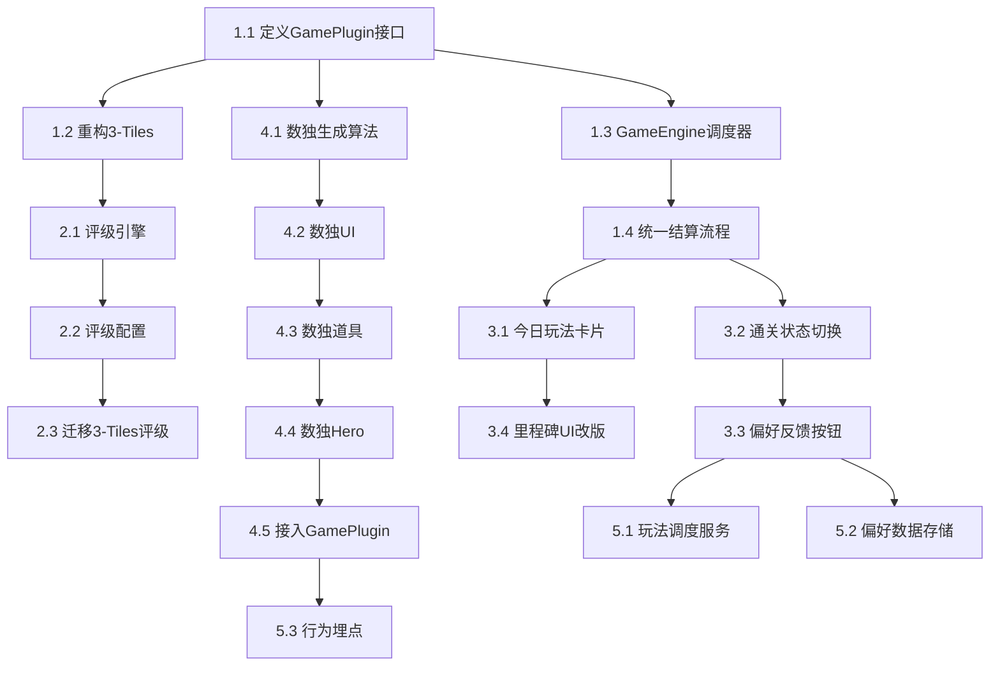

---
projects:
  - "[[AMIO]]"
tags:
  - cc
---

# 星光页面架构升级 · 第一阶段任务拆解

## 多玩法框架搭建 + 数独验证

> **目标：把"单游戏页面"升级为"多玩法框架"，用数独验证架构可行性**
>
> 这个阶段结束后，再加一种新玩法时，只需要写玩法本身的逻辑和UI，不需要改框架层任何代码。

---

# 目录

- [[#阶段总览]]
- [[#模块一：玩法抽象层（架构核心）]]
- [[#模块二：统一宝箱评级]]
- [[#模块三：星光页面 UI 重设计]]
- [[#模块四：数独玩法开发]]
- [[#模块五：推荐与偏好基础设施]]
- [[#依赖关系与开发顺序]]
- [[#验收标准]]

---

# 阶段总览

## 核心原则

- **架构优先**：先搭框架，再填内容
- **最小验证**：仅增加数独一种玩法，验证"第二种玩法能无缝接入"
- **不改功能**：3-Tiles 现有功能和体验完全不变，只做架构迁移
- **为未来铺路**：记忆翻牌、乒乓训练等后续玩法只需实现 GamePlugin 接口即可接入

## 工时估算总览

| 模块 | 预估工时 | 依赖 |
|------|----------|------|
| 模块一：玩法抽象层 | 1 周 | 无 |
| 模块二：统一宝箱评级 | 2 天 | 模块一 |
| 模块三：星光页面 UI | 1 周 | 模块一 |
| 模块四：数独玩法 | 1.5 周 | 模块一、二 |
| 模块五：推荐与偏好 | 3 天 | 模块三 |
| **合计** | **约 4 周** | |

---

# 模块一：玩法抽象层（架构核心）

> 把现有 3-Tiles 和星光页面的紧耦合关系拆开，定义通用的玩法插件接口，让每种玩法成为可插拔的模块。

## 任务 1.1：定义 GamePlugin 接口规范

**目标**：制定所有玩法必须遵守的统一接口协议。

**接口定义**：

```typescript
interface GamePlugin {
  /** 玩法唯一标识 */
  id: string;                    // e.g. "3tiles", "sudoku", "memory"

  /** 玩法元信息（用于星光页面卡片渲染） */
  meta: GameMeta;

  /** 初始化一局游戏，返回初始状态 */
  initGame(config: GameConfig): GameState;

  /** 处理用户操作，返回新状态 */
  handleAction(state: GameState, action: GameAction): GameState;

  /** 判定当前状态：进行中 / 通关 / 失败 */
  getStatus(state: GameState): GameStatus;

  /** 获取本局效率指标（用于宝箱评级） */
  getPerformance(state: GameState): PerformanceMetrics;

  /** 道具列表及效果 */
  getTools(): GameTool[];

  /** 使用道具，返回新状态 */
  useTool(state: GameState, toolId: string): GameState;

  /** Hero模式配置 */
  getHeroConfig(): HeroConfig;

  /** 游戏UI组件 */
  GameComponent: React.ComponentType<GameComponentProps>;
}
```

**玩法元信息**：

```typescript
interface GameMeta {
  id: string;
  narrativeName: string;         // "星图解密"
  narrativeDesc: string;         // "破译星球古老星图的密码"
  icon: string;                  // "🔮"
  thumbnailComponent: React.ComponentType;  // 缩略图预览组件
  energyReward: number;          // 基础能源奖励 e.g. 120
}
```

**效率指标（通用）**：

```typescript
interface PerformanceMetrics {
  /** 效率分 0-100，越高越好 */
  efficiencyScore: number;
  /** 道具使用数 */
  toolsUsed: number;
  /** 原始数据（各玩法自定义，用于埋点） */
  rawData: Record<string, any>;
}
```

**交付物**：
- `src/types/game-plugin.ts` — 完整类型定义文件
- `docs/game-plugin-spec.md` — 接口规范说明文档

---

## 任务 1.2：重构 3-Tiles 为 GamePlugin 实现

**目标**：把现有 3-Tiles 的所有逻辑迁移为符合 GamePlugin 接口的实现，功能和体验完全不变。

**具体工作**：

- 将现有游戏逻辑封装到 `src/games/3tiles/index.ts`
- 实现 `GamePlugin` 接口的所有方法
- 将现有游戏 UI 组件封装为 `GameComponent`
- 原有道具（撤回、移出、洗牌）迁移到 `getTools()` / `useTool()`
- 原有宝箱评级逻辑迁移到 `getPerformance()`

**验证标准**：
- 重构前后，3-Tiles 的完整游戏流程（普通+Hero）体验无任何差异
- 所有现有测试用例通过

**目录结构**：

```
src/games/
  ├── 3tiles/
  │   ├── index.ts          ← GamePlugin 实现
  │   ├── logic.ts          ← 游戏核心逻辑（从现有代码迁移）
  │   ├── components/       ← 游戏UI组件（从现有代码迁移）
  │   │   ├── Board.tsx
  │   │   ├── Tile.tsx
  │   │   ├── Slot.tsx
  │   │   └── ...
  │   ├── hero.ts           ← Hero模式配置
  │   └── thumbnail.tsx     ← 缩略图预览组件
  └── registry.ts           ← 玩法注册表
```

---

## 任务 1.3：实现 GameEngine 调度器

**目标**：创建游戏引擎，负责加载当日玩法、管理游戏生命周期、衔接结算流程。

**核心职责**：

```typescript
class GameEngine {
  /** 获取今日玩法（从推荐服务获取） */
  getTodayGame(): GamePlugin;

  /** 开始一局游戏 */
  startGame(mode: "normal" | "hero"): void;

  /** 游戏结束回调 */
  onGameEnd(result: GameResult): void;

  /** 进入结算流程 */
  enterSettlement(result: GameResult): void;
}
```

**生命周期**：

```
GameEngine.getTodayGame()
    → 加载对应 GamePlugin
    → GamePlugin.initGame(config)
    → 用户操作 → GamePlugin.handleAction()
    → GamePlugin.getStatus() === "cleared"
    → GamePlugin.getPerformance()
    → ChestRatingEngine.rate(performance)    ← 模块二
    → 进入结算流程（偏好反馈 + Hero入口）    ← 模块三
```

**交付物**：
- `src/engine/game-engine.ts`
- `src/engine/game-registry.ts` — 玩法注册表（注册/查找 GamePlugin）

---

## 任务 1.4：统一游戏结算流程

**目标**：抽出通用的结算流程组件，所有玩法共用。

**结算流程**：

```
通关动画（各玩法自定义）
    → 通用结算面板
        → 显示能源获取 + 宝箱等级
        → 偏好反馈（喜欢/不喜欢）
        → Hero模式入口
        → "今天就到这里吧" 退出按钮
    → [若进入Hero] → 加载Hero配置 → 游戏流程 → Hero结算
```

**交付物**：
- `src/components/GameSettlement/` — 通用结算面板组件
- 结算面板接收 `GameResult` + `ChestLevel` 作为输入，不依赖任何具体玩法

---

# 模块二：统一宝箱评级

> 从 3-Tiles 中抽出评级逻辑，构建通用评级引擎。

## 任务 2.1：抽象评级引擎

**目标**：创建独立的宝箱评级服务，输入效率指标，输出宝箱等级。

```typescript
class ChestRatingEngine {
  /**
   * 根据效率指标和玩法配置计算宝箱等级
   */
  rate(
    performance: PerformanceMetrics,
    ratingConfig: RatingConfig
  ): ChestLevel;
}

type ChestLevel = "diamond" | "gold" | "silver" | "bronze";

interface RatingConfig {
  diamond: { maxEfficiencyScore: number; maxToolsUsed: number };
  gold:    { maxEfficiencyScore: number; maxToolsUsed: number };
  silver:  { maxEfficiencyScore: number; maxToolsUsed: number };
  // bronze = 兜底
}
```

**交付物**：
- `src/engine/chest-rating.ts`

---

## 任务 2.2：定义各玩法评级参数配置

**目标**：为每种玩法定义 `RatingConfig`，统一管理。

**3-Tiles 评级配置**：

```typescript
const tilesRatingConfig: RatingConfig = {
  diamond: { maxEfficiencyScore: 95, maxToolsUsed: 0 },  // 1次通关+0道具
  gold:    { maxEfficiencyScore: 75, maxToolsUsed: 1 },  // 1-2次+≤1道具
  silver:  { maxEfficiencyScore: 50, maxToolsUsed: 2 },  // 3-5次+≤2道具
};
```

**数独评级配置**：

```typescript
const sudokuRatingConfig: RatingConfig = {
  diamond: { maxEfficiencyScore: 90, maxToolsUsed: 0 },  // 2分钟内+0道具
  gold:    { maxEfficiencyScore: 70, maxToolsUsed: 1 },  // 4分钟内+≤1道具
  silver:  { maxEfficiencyScore: 40, maxToolsUsed: 2 },  // 8分钟内+≤2道具
};
```

**交付物**：
- `src/games/3tiles/rating-config.ts`
- `src/games/sudoku/rating-config.ts`

---

## 任务 2.3：迁移现有 3-Tiles 评级逻辑

**目标**：移除 3-Tiles 中硬编码的评级逻辑，改为调用通用评级引擎。

**验证标准**：
- 迁移前后，相同游戏表现得到相同宝箱等级
- 评级引擎单元测试覆盖所有边界情况

---

# 模块三：星光页面 UI 重设计

> 基于 [[StarLight_MultiGame_PRD]] 中的布局方案，重新实现星光页面。

## 任务 3.1：今日玩法卡片组件

**目标**：替换现有"点亮"按钮区域，展示今日玩法信息。

**组件**：`src/components/TodayGameCard/`

**卡片内容**（从 GamePlugin.meta 动态读取）：

```
┌───────────────────────────────────────┐
│                                       │
│  🔮 今日采集方式                       │
│                                       │
│        「星图解密」                    │
│  破译星球古老星图的密码                 │
│                                       │
│  ┌─────────────────────────────────┐  │
│  │   [GamePlugin.thumbnailComponent]│  │
│  │   玩法示意缩略图/动画            │  │
│  └─────────────────────────────────┘  │
│                                       │
│  ⚡ 可获能源 +120   🏆 最佳: 01:23   │
│                                       │
│       ┌──────────────────┐            │
│       │   ✨ 开始采集     │            │
│       └──────────────────┘            │
│                                       │
└───────────────────────────────────────┘
```

**技术要点**：
- 卡片从 `GameEngine.getTodayGame().meta` 获取所有展示数据
- "最佳成绩"从本地存储读取，按玩法 id 分别记录
- 缩略图组件由各 GamePlugin 自行提供

---

## 任务 3.2：通关后状态切换

**目标**：普通模式通关后，今日玩法卡片原地变换为已完成状态。

**完成态布局**：

```
┌───────────────────────────────────────┐
│                                       │
│  ✅ 今日采集完成                       │
│                                       │
│      「星图解密」                      │
│                                       │
│  ⚡ +120 已传送至鲨之星               │
│  📦 获得 🥇 金色宝箱                  │
│                                       │
│  ┌─────────────────────────────────┐  │
│  │  这种采集方式，你觉得如何？      │  │
│  │  [💙 喜欢]      [💔 不太喜欢]    │  │
│  └─────────────────────────────────┘  │
│                                       │
│  ─ ─ ─ ─ ─ ─ ─ ─ ─ ─ ─ ─ ─ ─ ─ ─  │
│                                       │
│  🏓 Hero挑战已解锁                    │
│  "高难度开发任务 · 仅1次机会"          │
│  通关：宝箱升2级 + 周边概率×3         │
│  失败：无惩罚，保持原宝箱等级          │
│                                       │
│       ┌──────────────────┐            │
│       │   ⚡ 挑战Hero     │            │
│       └──────────────────┘            │
│                                       │
│   [今天就到这里吧 →]                   │
│                                       │
└───────────────────────────────────────┘
```

**技术要点**：
- 卡片状态：`idle` → `playing` → `completed` → `hero` → `done`
- 状态切换带过渡动画（淡入淡出或卡片翻转）
- Hero 完成或放弃后，卡片进入 `done` 状态，显示最终结果

---

## 任务 3.3：偏好反馈按钮

**目标**：通关后展示偏好反馈，收集用户数据。

**交互规范**：

| 项目 | 规范 |
|------|------|
| 按钮样式 | 💙喜欢（蓝色描边）/ 💔不太喜欢（灰色描边） |
| 点击反馈 | 按钮变实心，出现文字"AI 已记住你的偏好 ✓" |
| 可修改 | 点击后可再次点击切换 |
| 非强制 | 可直接忽略，进入 Hero 或离开 |
| 数据上报 | `{ user_id, date, game_type, feedback: "liked" / "disliked" / "skipped" }` |

**交付物**：
- `src/components/PreferenceFeedback/`

---

## 任务 3.4：连续天数里程碑 UI 改版

**目标**：把 checkbox 列表改为横向进度点。

**旧方案**（删除）：

```
□ 连续通关7天，即可获得实体周边奖励！
□ 连续通关14天，即可获得实体贴纸包！
□ 连续通关30天，即可获得实体手链/挂件！
□ 连续通关60天，即可获得限定礼盒！
```

**新方案**：

```
🔥 连续点亮 13 天

  ✅        ✅        ○         ○
 7天周边   14天贴纸   30天手链   60天礼盒
                    [还差17天]
```

**技术要点**：
- 已达成：✅ + 亮色文字
- 下一目标：○ + 高亮 + "还差X天"标注
- 未来目标：○ + 灰色文字
- 横向可滚动（当里程碑较多时）

**交付物**：
- `src/components/StreakMilestones/` — 替换现有签到组件

---

# 模块四：数独玩法开发

> 在新架构上实现第一个新玩法，验证 GamePlugin 接口的完整性。

## 任务 4.1：4×4 图标数独生成算法

**目标**：实现数独题目生成器，用偶像主题图标代替数字。

**规则**：
- 4×4 网格，4种图标：🏓 ⭐ 🦈 💙
- 每行、每列、每个2×2宫格内，4种图标各出现1次
- 预填 6-8 个格子（保证唯一解）

**算法思路**：
1. 生成完整的合法终盘（回溯法）
2. 随机挖空，每次挖空后验证唯一解
3. 控制挖空数量以调节难度

**交付物**：
- `src/games/sudoku/generator.ts` — 题目生成
- `src/games/sudoku/solver.ts` — 求解器（用于验证唯一解+提示道具）

---

## 任务 4.2：数独游戏 UI

**目标**：实现数独的完整游戏界面。

**界面布局**：

```
┌─────────────────────────────────────────┐
│  [✕]      星图解密      [⚙️]            │
├─────────────────────────────────────────┤
│                                         │
│  ┌────┬────┬────┬────┐                  │
│  │ 🏓 │    │ ⭐ │    │                  │
│  ├────┼────┼────┼────┤                  │
│  │    │ 🦈 │    │ 🏓 │                  │
│  ├────┼────┼────┼────┤                  │
│  │ ⭐ │    │ 💙 │    │                  │
│  ├────┼────┼────┼────┤                  │
│  │    │ 💙 │    │ 🦈 │                  │
│  └────┴────┴────┴────┘                  │
│                                         │
│  选择图标：                              │
│  [ 🏓 ] [ ⭐ ] [ 🦈 ] [ 💙 ] [ ✕清除 ]  │
│                                         │
├─────────────────────────────────────────┤
│  道具：[💡提示 1/1]  [✅检查 0/1]        │
└─────────────────────────────────────────┘
```

**交互流程**：
1. 点击空格子 → 格子高亮选中
2. 点击底部图标 → 填入选中格子
3. 点击"✕清除" → 清空选中格子
4. 已预填的格子不可修改（视觉区分：更亮/有底色）
5. 填满所有格子且全部正确 → 通关

**错误处理**：
- 填入时**不立即提示对错**（让用户自己发现和推理）
- 填满后如有错误 → 高亮错误格子 → 用户可修改

**交付物**：
- `src/games/sudoku/components/SudokuBoard.tsx`
- `src/games/sudoku/components/IconSelector.tsx`

---

## 任务 4.3：数独道具实现

**目标**：实现数独专属道具。

| 道具 | 效果 | 免费次数 | 付费方式 |
|------|------|----------|----------|
| 💡 提示 | 随机填入1个正确图标 | 1次 | 广告/50金币 |
| ✅ 检查 | 标出当前所有错误位置（红色高亮2秒） | 0次 | 广告/50金币 |

---

## 任务 4.4：数独 Hero 模式

**目标**：实现数独的高难度版本。

| 项目 | 普通模式 | Hero模式 |
|------|----------|----------|
| 网格大小 | 4×4 | 6×6 |
| 图标种类 | 4种（🏓⭐🦈💙） | 6种（+🏅👑） |
| 宫格划分 | 2×2 | 2×3 |
| 时间限制 | 无 | 3分钟 |
| 预填数量 | 6-8个 | 12-16个 |

**Hero模式新增UI元素**：
- 顶部倒计时进度条
- 时间不足30秒时，进度条变红+脉冲动画
- 时间耗尽 → 挑战失败

---

## 任务 4.5：接入 GamePlugin 接口

**目标**：将数独包装为符合 GamePlugin 接口的模块，注册到玩法注册表。

```typescript
// src/games/sudoku/index.ts
const sudokuPlugin: GamePlugin = {
  id: "sudoku",
  meta: {
    narrativeName: "星图解密",
    narrativeDesc: "破译星球古老星图的密码",
    icon: "🔮",
    thumbnailComponent: SudokuThumbnail,
    energyReward: 120,
  },
  initGame: (config) => { ... },
  handleAction: (state, action) => { ... },
  getStatus: (state) => { ... },
  getPerformance: (state) => { ... },
  getTools: () => [ ... ],
  useTool: (state, toolId) => { ... },
  getHeroConfig: () => ({ ... }),
  GameComponent: SudokuGame,
};
```

**验证标准**：
- 数独可通过 GameEngine 加载和运行
- 通关后正确触发统一结算流程（宝箱评级 + 偏好反馈 + Hero入口）
- Hero模式正常工作

---

# 模块五：推荐与偏好基础设施

> 搭建最基础的"今天推什么玩法"的调度能力，暂不做智能推荐。

## 任务 5.1：每日玩法调度服务

**目标**：决定每天推送给用户哪种玩法。

**第一阶段策略（冷启动固定序列）**：

由于 MVP 只有 2 种玩法（3-Tiles + 数独），采用简单交替：

```
Day 1: 3tiles
Day 2: sudoku
Day 3: 3tiles
Day 4: sudoku
...
```

后续当玩法库扩充到 3 种以上时，切换为基于偏好数据的加权随机。

**接口设计**：

```typescript
class GameScheduler {
  /**
   * 获取指定用户当日应该玩的游戏类型
   * 当前：固定交替
   * 未来：基于偏好的加权随机
   */
  getTodayGameType(userId: string, date: string): string;
}
```

**交付物**：
- `src/engine/game-scheduler.ts`

---

## 任务 5.2：偏好数据存储

**目标**：存储用户的显式偏好反馈。

**数据结构**：

```typescript
interface PreferenceRecord {
  userId: string;
  date: string;          // "2026-02-11"
  gameType: string;      // "sudoku"
  feedback: "liked" | "disliked" | "skipped";
}
```

**存储方案**：
- MVP 阶段存本地（localStorage / Taro Storage）
- 后端 API 就绪后同步至服务端

**交付物**：
- `src/services/preference-store.ts`

---

## 任务 5.3：游戏行为埋点

**目标**：记录每局游戏的关键行为数据，为后续推荐算法提供数据基础。

**每局必须记录的数据**：

```typescript
interface GameSessionLog {
  userId: string;
  date: string;
  gameType: string;          // "3tiles" | "sudoku"
  mode: "normal" | "hero";
  result: "cleared" | "failed" | "quit";
  attempts: number;           // 重试次数（普通模式）
  durationSeconds: number;    // 本局时长
  toolsUsed: number;          // 道具使用数
  chestLevel: ChestLevel;     // 宝箱等级
  heroAttempted: boolean;
  heroResult?: "cleared" | "failed";
  feedback?: "liked" | "disliked" | "skipped";
}
```

**交付物**：
- `src/services/game-logger.ts`
- 埋点在 GameEngine.onGameEnd() 中统一触发

---

# 依赖关系与开发顺序



**建议开发顺序**：

| 周次 | 任务 | 说明 |
|------|------|------|
| 第1周 | 1.1 → 1.2 → 1.3 → 1.4 | 搭建框架，重构3-Tiles |
| 第2周 | 2.1 → 2.2 → 2.3 + 3.1 → 3.2 | 评级引擎 + 星光页面基础 |
| 第3周 | 3.3 → 3.4 + 4.1 → 4.2 → 4.3 | 页面完善 + 数独核心开发 |
| 第4周 | 4.4 → 4.5 + 5.1 → 5.2 → 5.3 | 数独Hero + 推荐基础 + 联调 |

---

# 验收标准

## 架构验收

- [ ] 3-Tiles 重构后功能无回归，所有现有流程正常
- [ ] 数独作为新玩法，仅通过实现 GamePlugin 接口即接入，未修改任何框架层代码
- [ ] GameEngine 能根据调度结果加载不同玩法
- [ ] 统一结算流程（宝箱评级→偏好反馈→Hero入口）对所有玩法生效

## 功能验收

- [ ] 星光页面正确展示今日玩法卡片（名称、描述、缩略图、能源奖励）
- [ ] 3-Tiles 完整流程：开始→通关→宝箱评级→偏好反馈→Hero→结算
- [ ] 数独完整流程：开始→通关→宝箱评级→偏好反馈→Hero→结算
- [ ] 数独普通模式：4×4图标数独，可填入/清除/提示/检查
- [ ] 数独Hero模式：6×6网格，3分钟倒计时
- [ ] 偏好反馈按钮正常工作，数据正确存储
- [ ] 连续天数里程碑展示为横向进度点
- [ ] 每日玩法调度正确交替推送

## 扩展性验证

- [ ] 模拟接入第三种玩法（空壳 GamePlugin），确认注册到框架后星光页面能正确展示
- [ ] 评级引擎能通过新的 RatingConfig 支持新玩法，无需修改引擎代码

---

> **文档版本**：V1.0
>
> **AMIO · Keep Us Human**
>
> **"好的架构，让每一种新的采集方式都能轻松加入星球"**
